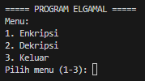

# ElGamal - Implementasi Python

## Identitas
- **Nama** : Nazwa Nashatasya
- **NPM**  : 140810230019  

## Pendahuluan
**ElGamal Cipher** adalah salah satu algoritma **kriptografi kunci publik** yang berbasis pada perhitungan logaritma diskret.  
Algoritma ini menggunakan **kunci publik (p, g, y)** untuk enkripsi dan **kunci privat (x)** untuk dekripsi.  

Program ini dibuat untuk membantu memahami proses **enkripsi** dan **dekripsi** ElGamal dengan menampilkan:
- **Perhitungan detail** setiap langkah.  
- **Tabel hasil enkripsi/dekripsi** agar mudah dipahami.  

## Fitur Utama
1. **Enkripsi**
   - Input berupa:
     - `p` (bilangan prima besar)
     - `g` (generator/basis)
     - `x` (kunci privat)
     - `k` (bilangan acak untuk enkripsi)
     - `plaintext` (teks huruf A–Z)
   - Program akan:
     - Mengonversi plaintext ke angka (A=0,...,Z=25).
     - Menghitung kunci publik `y = g^x mod p`.
     - Menghitung `C1 = g^k mod p`.
     - Menghitung `C2 = M * y^k mod p` untuk tiap karakter.
   - Hasil enkripsi berupa daftar pasangan `(C1, C2)`.
   - Proses perhitungan ditampilkan langkah demi langkah.

2. **Dekripsi**
   - Input berupa:
     - `p` (bilangan prima besar)
     - `x` (kunci privat)
     - Daftar pasangan ciphertext `(C1, C2)`
   - Program akan:
     - Menghitung `s = C1^x mod p`.
     - Menghitung invers modulo `s^-1 mod p`.
     - Menghitung `M = C2 * s^-1 mod p`.
     - Mengonversi angka `M` kembali ke huruf.
   - Proses perhitungan ditampilkan langkah demi langkah.

3. **Tabel Enkripsi & Dekripsi**
   - Tabel enkripsi berisi: **Index | PT | n(PT) | C1 | C2 | CT**
   - Tabel dekripsi berisi: **Index | C1 | C2 | M | PT**  

## Alur Program
1. Program menampilkan menu utama:
   ```
   ===== PROGRAM HILL CIPHER =====
   Menu:
   1. Enkripsi
   2. Dekripsi
   3. Keluar
   Pilih menu (1-3):
   ```
2. User memilih salah satu menu.
- **1. Enkripsi** → Input p, g, x, k, dan plaintext → program menampilkan proses enkripsi + tabel hasil.  
- **2. Dekripsi** → Input p, x, dan ciphertext (pasangan C1, C2) → program menampilkan proses dekripsi + tabel hasil.  
- **3. Keluar** → Program berhenti.
3. Hasil ditampilkan di layar secara detail.

## Screenshots
- **Menu Utama**  
  

- **Enkripsi**   
    

- **Dekripsi**  
  
  
  

- **Keluar**  
   

## Cara Menjalankan
- Pastikan Python sudah terinstall.  
  ```bash
  python --version
  ```
- Jalankan program dengan:
  ```bash
  python elgamal.py
  ```

## Catatan
- Program hanya mengenali huruf alfabet (A-Z).
- Input akan otomatis diubah menjadi huruf kapital.
- Spasi pada input plaintext akan diabaikan.