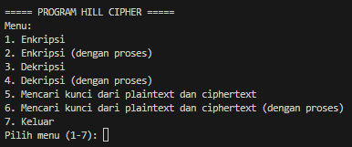
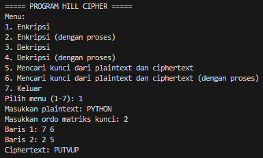
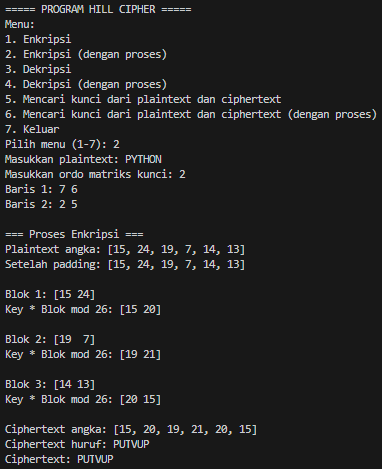
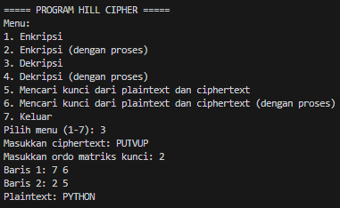
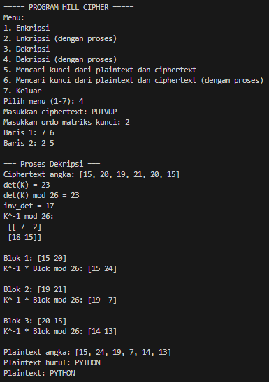
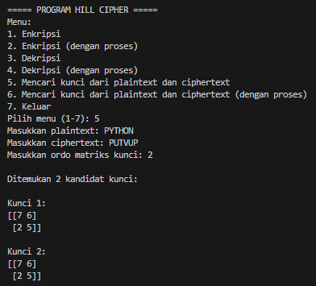
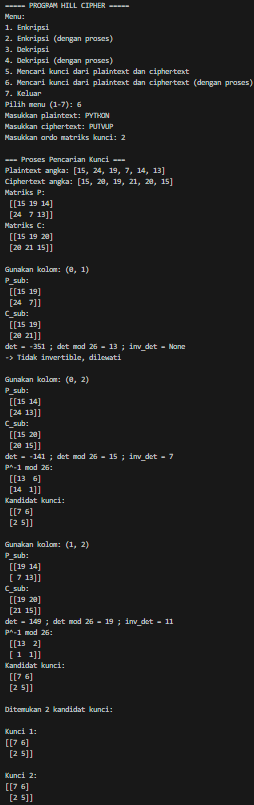
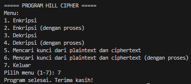

# Hill Cipher - Implementasi Python

## Identitas
- **Nama** : Nazwa Nashatasya
- **NPM**  : 140810230019  

## Pendahuluan
Hill Cipher adalah salah satu algoritma kriptografi klasik berbasis aljabar linear.  
Program ini dibuat untuk membantu memahami proses **enkripsi**, **dekripsi**, serta bagaimana **mencari matriks kunci** hanya dari pasangan plaintext dan ciphertext.

## Fitur Utama
1. **Enkripsi**  
   - Input berupa plaintext dan matriks kunci.  
   - Pesan diubah menjadi angka (A=0,...,Z=25), dibagi dalam blok, lalu dikalikan matriks kunci (mod 26).   

2. **Dekripsi**  
   - Input berupa ciphertext dan matriks kunci.  
   - Program menghitung invers matriks kunci modulo 26, kemudian mengalikannya dengan ciphertext untuk mengembalikan plaintext.  

3. **Mencari Kunci dari Plaintext dan Ciphertext**  
   - Input berupa pasangan plaintext dan ciphertext dengan panjang minimal n² huruf (untuk kunci n×n).  
   - Program akan membentuk matriks P (plaintext) dan C (ciphertext), mencari submatriks invertible, lalu menghitung kunci Hill Cipher dengan rumus:  
     K ≡ C · P⁻¹ (mod 26)

## Alur Program
1. Program menampilkan menu utama:
   ```
   ===== PROGRAM HILL CIPHER =====
   Menu:
   1. Enkripsi
   2. Enkripsi (dengan proses)
   3. Dekripsi
   4. Dekripsi (dengan proses)
   5. Mencari kunci dari plaintext dan ciphertext
   6. Mencari kunci dari plaintext dan ciphertext (dengan proses)
   7. Keluar
   Pilih menu (1-7):
   ```
2. User memilih salah satu menu.
3. Program meminta input sesuai pilihan:
   - Plaintext & kunci (untuk enkripsi)  
   - Ciphertext & kunci (untuk dekripsi)  
   - Plaintext & ciphertext (untuk mencari kunci)  
4. Program menjalankan proses Hill Cipher (enkripsi, dekripsi, atau pencarian kunci).  
5. Hasil ditampilkan di layar.  
6. Program kembali ke menu utama hingga user memilih keluar.  

## Screenshots
- **Menu Utama**  
  

- **Enkripsi**   
    
  

- **Dekripsi**  
  
  

- **Mencari Kunci**  
    
    

- **Keluar**  
   

## Cara Menjalankan
- Pastikan Python dan library `numpy` sudah terinstall.  
  ```bash
  pip install numpy
  ```
- Jalankan program dengan:
  ```bash
  python hillcipher.py
  ```

## Catatan
- Jika panjang plaintext tidak habis dibagi ukuran kunci, program otomatis menambahkan huruf 'A' sebagai padding.
- Tidak semua matriks kunci valid, hanya matriks dengan determinan relatif prima terhadap 26 yang dapat digunakan.
- Program ini ditujukan untuk pembelajaran kriptografi klasik.
