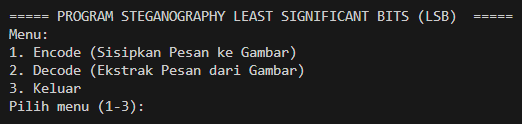
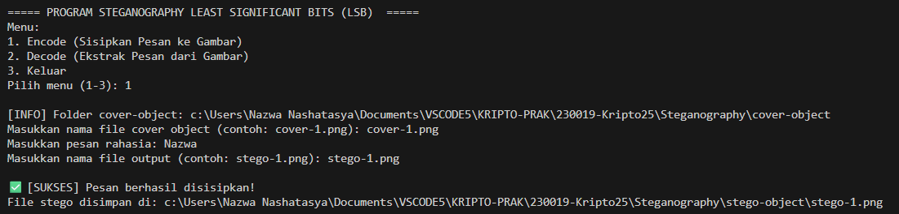
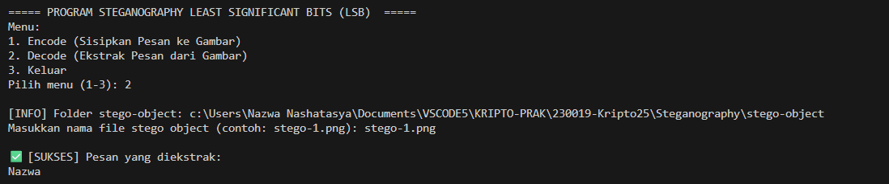
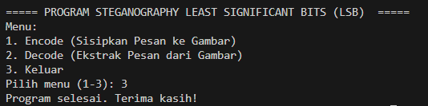

# Least Significant Bits (LSB) - Implementasi Python

## Identitas
- **Nama** : Nazwa Nashatasya
- **NPM**  : 140810230019  

## Pendahuluan
Least Significant Bits (LSB) adalah salah satu **metode steganografi digital** yang digunakan untuk **menyembunyikan informasi rahasia di dalam media digital**, seperti gambar.  
Pada LSB ini, .

Pada metode ini, **bit paling tidak signifikan (Least Significant Bit)** dari setiap piksel gambar diubah sesuai dengan bit pesan yang ingin disembunyikan. Perubahan ini sangat kecil sehingga **tidak terlihat oleh mata manusia**, namun tetap memungkinkan untuk **menyimpan data tersembunyi** di dalam gambar.

Program ini dibuat untuk membantu memahami proses **encode (penyisipan pesan)** dan **decode (ekstraksi pesan)** dalam metode LSB, dengan menampilkan **peringatan (warning)**, **validasi input**, serta **informasi folder dan hasil proses** di terminal.

## Fitur Utama
1. **Encode**  
  - Input berupa:
    - File gambar cover (misal: cover-1.png) dari folder cover-object
    - Pesan teks rahasia
    - Nama file output hasil stego
  - Program akan:
    - Memvalidasi keberadaan folder dan file input
    - Mengonversi pesan teks menjadi representasi biner
    - Menyisipkan bit pesan ke dalam bit paling rendah (LSB) pada tiap kanal RGB gambar
    - Menyimpan gambar hasil embedding ke folder stego-object
  - Hasil akhir berupa file baru berisi pesan tersembunyi tanpa perbedaan visual dari gambar aslinya.

2. **Decode**  
  - Input berupa:
    - File gambar stego (misal: stego-1.png) dari folder stego-object
  - Program akan:
    - Membaca bit paling rendah (LSB) dari tiap kanal RGB gambar
    - Menggabungkan bit-bit hasil pembacaan hingga menemukan delimiter (1111111111111110)
    - Mengonversi kembali bit pesan menjadi teks asli
    - Menampilkan pesan yang berhasil diekstrak ke layar
  - Jika tidak ditemukan pesan tersembunyi, program akan memberikan peringatan.

## Alur Program
1. Program menampilkan menu utama:
   ```
   ===== PROGRAM STEGANOGRAPHY LEAST SIGNIFICANT BITS (LSB) =====
   Menu:
   1. Encode (Sisipkan Pesan ke Gambar)
   2. Decode (Ekstrak Pesan dari Gambar)
   3. Keluar
   Pilih menu (1-3):
   ```
2. User memilih salah satu menu.
  - **1. Encode** → Input file cover, pesan rahasia, dan nama file output.
  - **2. Decode** → Input file stego untuk mengekstrak pesan.
  - **3. Keluar** → Program berhenti.  
3. Program menjalankan proses sesuai pilihan dan menampilkan hasil.
4. Program kembali ke menu utama hingga user memilih keluar.  

## Screenshots
- **Menu Utama**  
  

- **Encode**   
    

- **Decode**  
  

- **Keluar**  
   

## Cara Menjalankan
- Pastikan Python sudah terinstall.  
  ```bash
  python --version
  ```
- Pastikan library Pillow sudah terinstall.  
  ```bash
  pip install Pillow
  ```
- Jalankan program dengan:
  ```bash
  python LSB.py
  ```

## Catatan
- Program tidak akan berjalan jika folder cover-object atau stego-object tidak ditemukan.
- Nama file tidak boleh kosong dan harus berformat .png, .jpg, atau .jpeg.
- Pesan rahasia tidak boleh kosong.
- Jika ukuran pesan terlalu besar untuk disisipkan ke dalam gambar, program akan menampilkan pesan error: “Pesan terlalu besar! Kapasitas maksimal: ... bit”
- Gambar hasil encode akan disimpan otomatis ke folder stego-object.
- Gunakan gambar cover berukuran sedang atau besar untuk hasil optimal.