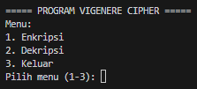
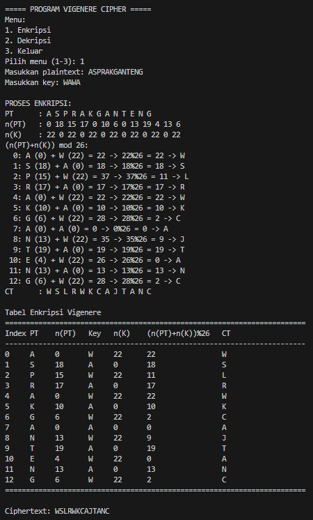
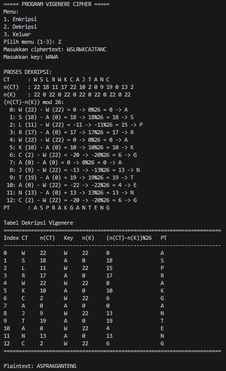
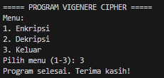

# Vigenere Cipher - Implementasi Python

## Identitas
- **Nama** : Nazwa Nashatasya
- **NPM**  : 140810230019  

## Pendahuluan
Vigenere Cipher adalah salah satu algoritma **kriptografi klasik** yang menggunakan metode **substitusi polialfabetik**.  
Pada cipher ini, setiap huruf plaintext dienkripsi dengan cara menjumlahkan posisinya dengan huruf kunci (key) secara berulang, lalu dihitung modulo 26.

Program ini dibuat untuk membantu memahami proses **enkripsi** dan **dekripsi** Vigenere Cipher dengan menampilkan **perhitungan detail** serta **tabel hasil enkripsi/dekripsi**.

## Fitur Utama
1. **Enkripsi**  
  - Input berupa plaintext dan key (kata kunci).  
  - Program akan:
    - Mengonversi huruf plaintext dan key ke angka (A=0,...,Z=25).  
    - Melakukan operasi `(n(PT) + n(K)) mod 26` untuk setiap huruf.  
    - Menghasilkan ciphertext.  
  - Ditampilkan proses enkripsi langkah demi langkah.   

2. **Dekripsi**  
  - Input berupa ciphertext dan key.  
  - Program akan:
    - Mengonversi huruf ciphertext dan key ke angka.  
    - Melakukan operasi `(n(CT) - n(K)) mod 26`.  
    - Menghasilkan plaintext kembali.  
  - Ditampilkan proses dekripsi langkah demi langkah.

3. **Tabel Enkripsi dan Dekripsi**  
  - Selain proses detail, program juga menyediakan output dalam bentuk tabel rapi:
    - Index, Plaintext/Ciphertext, nilai numerik, Key, hasil modulo, dan huruf hasil.  

## Alur Program
1. Program menampilkan menu utama:
   ```
   ===== PROGRAM HILL CIPHER =====
   Menu:
   1. Enkripsi
   2. Dekripsi
   3. Keluar
   Pilih menu (1-3):
   ```
2. User memilih salah satu menu.
  - **1. Enkripsi** → Input plaintext & key → ditampilkan proses enkripsi dan tabel hasil.  
  - **2. Dekripsi** → Input ciphertext & key → ditampilkan proses dekripsi dan tabel hasil.  
  - **3. Keluar** → Program berhenti.  
3. Program menjalankan proses Vigenere Cipher (enkripsi, dekripsi).  
4. Hasil ditampilkan di layar.  
5. Program kembali ke menu utama hingga user memilih keluar.  

## Screenshots
- **Menu Utama**  
  

- **Enkripsi**   
    

- **Dekripsi**  
  

- **Keluar**  
   

## Cara Menjalankan
- Pastikan Python sudah terinstall.  
  ```bash
  python --version
  ```
- Jalankan program dengan:
  ```bash
  python vigenerecipher.py
  ```

## Catatan
- Program hanya mengenali huruf alfabet (A-Z).
- Input akan otomatis diubah menjadi huruf kapital.
- Spasi pada input plaintext/ciphertext akan diabaikan.